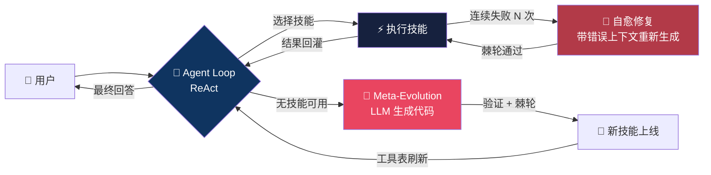
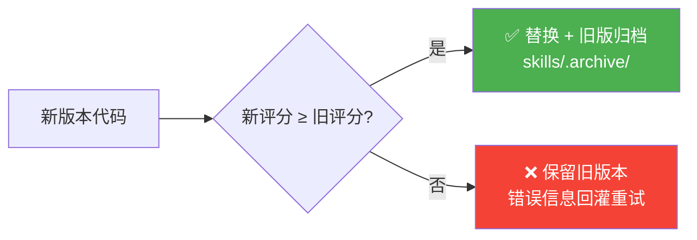
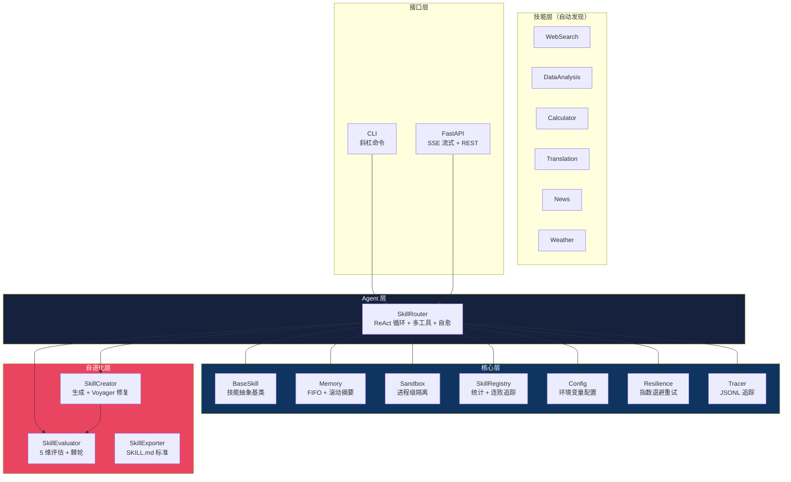

<div align="center">

# 🧠 Synapse

**自进化 AI Agent 框架 — 当 Agent 遇到不会的事，它会自己写代码学会**

[](https://python.org)
[](LICENSE)
[](https://github.com/Wayhhow/Synapse/actions/workflows/ci.yml)
[](#测试)
[](https://agentskills.io)

[English](#english) · [快速开始](#快速开始) · [架构](#架构) · [配置](#配置) · [设计哲学](#设计哲学)

</div>

---

> *"如果 Agent 遇到一个它不会的任务，它不应该说'我做不到'——它应该说'等我一下，我去学一下'。"*

Synapse 是一个**自进化（Meta-Evolution）AI Agent 框架**。它以 ReAct 式 Agent 循环驱动：每一轮 LLM 可以调用技能（tool），执行结果回灌到上下文继续推理；当没有技能能处理请求时，Synapse 调用 LLM 现场生成新的 Python 技能文件、验证、加载并立即投入执行——**Agent 在运行时自己教自己新能力，坏了还会自己修**。

## 核心循环



与 v1 的"单发路由"不同，v2 的 Agent 循环（借鉴 [OpenManus](https://github.com/FoundationAgents/OpenManus) 的 ReAct 架构）意味着：LLM 看得到每次工具执行的真实结果，可以在一步里调用多个工具、组合信息、对失败做出反应，最后给出自然语言的最终回答。

## 六大机制

### 1️⃣ Agent 循环（ReAct）

每条查询最多 `SYNAPSE_MAX_STEPS`（默认 5）轮 LLM 推理。工具结果以 `tool` 消息回灌，LLM 决定继续调用工具还是作答；单轮多工具调用全部执行；`SYNAPSE_MAX_STEPS=1` 可回退到 v1 单发行为（直接返回技能的结构化结果）。

### 2️⃣ Meta-Evolution — 运行时技能生成

没有技能能处理时，LLM 生成完整的 Python 技能文件（Pydantic 参数/响应模型 + `BaseSkill` 子类），经过四道关卡后自动加载执行：

| 关卡 | 拦截内容 |
|------|---------|
| 语法检查 | AST parse 失败 |
| 顶层安全检查 | `import` 即执行的调用（`os.system(...)` 等）——加载前拒绝（Bug-1 修复） |
| 反模式 AST 扫描 | `eval` / `exec` / `subprocess` / 文件删除等危险调用，含 `getattr(builtins, "eval")` 式混淆（Bug-28 修复） |
| 重复检测 | 与现有技能描述 Jaccard ≥ 0.5 视为重复，不再生成 |

### 3️⃣ Voyager 式迭代修复（v2 新增）

借鉴 [Voyager](https://arxiv.org/abs/2305.16291) 的"迭代提示机制"：技能生成不是一次性赌博。生成 → 验证 → **把具体错误（语法/安全/棘轮/加载异常）回灌给 LLM 修复重试**，最多 `SYNAPSE_GENERATE_MAX_ATTEMPTS`（默认 3）轮。运行期同样：技能**连续失败 ≥ 3 次**自动触发 `repair_skill`——把真实执行错误连同源码交给 LLM 修复，棘轮把关，旧版本自动归档。

### 4️⃣ 棘轮机制（Ratchet）



5 维度健康度评估（结构 20 / 成功率 30 / 错误处理 20 / 触发词具体性 15 / 反模式 15）。分数只升不降；被替换的旧技能进入 `skills/.archive/<技能名>/` 时间戳归档，进化留下化石记录。

### 5️⃣ 分层记忆（v2 增强）

- 短期：每 session 最近 N 轮 FIFO（`SYNAPSE_MEMORY_MAX_HISTORY`，默认 10 轮）
- 滚动摘要（借鉴 [mem0](https://github.com/mem0ai/mem0) / [Letta](https://github.com/letta-ai/letta) 的分层思路）：配置 API Key 后，被挤出的历史自动压缩为摘要，随每轮上下文前置注入；无 Key 时优雅降级为纯 FIFO
- JSON 原子写入 + `RLock` 并发安全，摘要持久化到独立 sidecar 文件（主文件格式向后兼容）

### 6️⃣ 全链路追踪（v2 新增）

每条查询一条 JSONL 记录（`data/traces.jsonl`）：每轮 LLM 耗时、每个技能执行成败、最终结局。`GET /traces` 直接读取最近记录，`tail -f` 即可实时观察 Agent 行为——本地版的 LangSmith。

## 多 Provider 支持（v2 新增）

任何 OpenAI 兼容端点开箱即用（借鉴 OpenManus 的 provider 无关设计）：

```bash
# DeepSeek
SYNAPSE_LLM_BASE_URL=https://api.deepseek.com/v1
SYNAPSE_MODEL=deepseek-chat

# OpenRouter / Qwen / GLM / Ollama 本地模型 同理
```

LLM 调用内置两层韧性：OpenAI SDK 传输层重试 + 应用层指数退避重试（限流/超时/5xx）。

## 快速开始

### 1. 安装

```bash
git clone https://github.com/Wayhhow/Synapse.git
cd Synapse
pip install -r requirements.txt
# 或者 pip install -e . 后使用 `synapse` 命令
```

### 2. 配置

```bash
cp .env.example .env
# 编辑 .env，填入 OPENAI_API_KEY（可选配置 SYNAPSE_LLM_BASE_URL 切换供应商）
```

### 3. 启动

```bash
python cli.py                      # CLI（支持 /skills /stats /history /clear /export 命令）
# 或
uvicorn web.app:app --reload       # Web UI（SSE 流式输出 + 技能面板 + 健康度仪表）
```

### 4. 试试这些

```
> 北京天气怎么样？
> 计算 (2 + 3) * 4 ** 2
> 分析这组数据: 23, 45, 12, 67, 34, 89, 56
> 帮我查一下苹果公司的股价    ← 触发 Meta-Evolution，现场写一个股票技能！
```

CLI 专属命令：`/help` `/skills` `/stats` `/history` `/clear` `/export [dir]` `/exit`

### 5. 导出为 Agent Skills 标准格式

```bash
python cli.py --export ./my_skills
```

每个技能导出为 [Agent Skills 开放标准](https://agentskills.io)（Anthropic 2025 年 10 月推出、2025 年 12 月开放标准化的 `SKILL.md` 格式）目录：`SKILL.md`（YAML frontmatter + 使用文档）+ `skill.py`（可执行源码）。Synapse 自动生成的技能可即刻被 Claude Code、Cursor、Codex CLI 等 20+ 生态工具识别。

## 架构



## 内置技能

所有技能**开箱即用**，无需额外 API Key（除 LLM 外）：

| 技能 | 说明 | 需要 Key? |
|------|------|----------|
| 🔍 **WebSearch** | DuckDuckGo 互联网搜索 | ❌ |
| 📊 **DataAnalysis** | 描述性统计（均值/中位数/标准差） | ❌ |
| 🧮 **Calculator** | AST 白名单安全数学计算 | ❌ |
| 🌐 **Translation** | MyMemory 文本翻译 | ❌ |
| 📰 **News** | Google News RSS | ❌ |
| 🌤️ **Weather** | Open-Meteo 天气 + 地理编码 | ❌ |
| 🧬 **Auto-Generated** | Meta-Evolution 运行时生成的技能 | 视情况 |

## 配置

全部通过环境变量（见 [.env.example](.env.example)），零配置文件依赖：

| 变量 | 默认值 | 说明 |
|------|--------|------|
| `OPENAI_API_KEY` | — | LLM 密钥 |
| `SYNAPSE_LLM_BASE_URL` | OpenAI 官方 | 任何 OpenAI 兼容端点 |
| `SYNAPSE_MODEL` | `gpt-4o-mini` | 模型名 |
| `SYNAPSE_MAX_STEPS` | `5` | Agent 循环最大轮数（1 = 单发模式） |
| `SYNAPSE_GENERATE_MAX_ATTEMPTS` | `3` | 技能生成的迭代修复轮数 |
| `SYNAPSE_AUTO_REPAIR` | `1` | 连续失败自动修复开关 |
| `SYNAPSE_AUTO_REPAIR_THRESHOLD` | `3` | 触发自愈的连败次数 |
| `SYNAPSE_SANDBOX_TIMEOUT` | `10` | 沙箱超时（秒） |
| `SYNAPSE_MEMORY_MAX_HISTORY` | `10` | 短期记忆轮数 |
| `SYNAPSE_TRACE` | `1` | JSONL 追踪开关 |

## Web API

| 端点 | 说明 |
|------|------|
| `POST /chat` | 同步对话，返回最终回答 + 技能归属 |
| `POST /chat/stream` | **SSE 流式**：逐事件推送推理/工具执行/最终回答 |
| `GET /skills` | 当前技能清单（含运行时生成的） |
| `GET /stats` | 5 维健康度报告 |
| `GET /traces` | 最近 N 条执行追踪 |
| `GET /history/{id}` · `DELETE /history/{id}` | 会话记忆读取/清除 |
| `GET /health` | 健康检查 |

## 如何写一个新技能

在 `skills/` 目录创建 Python 文件，继承 `BaseSkill`，保存即自动发现：

```python
from pydantic import BaseModel, Field
from typing import Type, Optional
from core.base import BaseSkill

class MyArgs(BaseModel):
    query: str = Field(..., description="搜索关键词")

class MyResponse(BaseModel):
    result: str
    error: Optional[str] = None

class MySkill(BaseSkill):
    @property
    def name(self) -> str:
        return "my_skill"

    @property
    def description(self) -> str:
        return "做什么事。触发词：xxx, yyy, zzz"  # 触发词影响 dim4 评分

    @property
    def expected_args(self) -> Type[BaseModel]:
        return MyArgs

    @property
    def expected_response_type(self) -> Type[BaseModel]:
        return MyResponse

    async def execute(self, **kwargs) -> MyResponse:
        args = self.validate_args(**kwargs)
        try:
            return MyResponse(result="...")
        except Exception as e:
            return MyResponse(result="", error=str(e))
```

## 测试

```bash
pip install -r requirements.txt pytest pytest-asyncio
pytest -q          # 141 个测试，覆盖 Agent 循环 / 自愈 / 棘轮 / 沙箱 / 记忆 / 追踪 / 导出
ruff check .       # Lint（CI 强制）
```

CI 在 GitHub Actions 上跑 Ubuntu + Windows × Python 3.10–3.13 的完整矩阵。

## 设计哲学

| # | 原则 | 说明 |
|---|------|------|
| 01 | **自动优于手动** | 技能自动发现、生成、评估、修复、归档 |
| 02 | **棘轮不倒退** | 评分只升不降；每次替换都有化石记录 |
| 03 | **反馈即燃料** | Voyager 式：错误信息回灌 LLM，自我修正 |
| 04 | **隔离保安全** | 生成代码跑在进程沙箱；AST 关卡在加载前拦截 |
| 05 | **记忆即上下文** | FIFO 短期 + 滚动摘要长期，重启不丢失 |
| 06 | **零锁定** | OpenAI 兼容端点通吃；SKILL.md 标准互通；零额外 Key |

### 与相关项目的对比

| 特性 | Synapse | AutoGPT | LangChain Agents | OpenManus |
|------|---------|---------|-----------------|-----------|
| ReAct Agent 循环 | ✅ | ✅ | ✅ | ✅ |
| 运行时技能生成 | ✅ Meta-Evolution | ❌ | ❌ | ❌ |
| 生成代码迭代修复 | ✅ Voyager 式 | ❌ | ❌ | ❌ |
| 技能质量评估 + 棘轮 | ✅ 5 维 | ❌ | ❌ | ❌ |
| 失败技能自愈 | ✅ 连败触发 | ❌ | ❌ | ❌ |
| SKILL.md 标准导出 | ✅ | ❌ | ❌ | ❌ |
| 执行追踪 | ✅ 本地 JSONL | ✅ 云服务 | ✅ LangSmith | ❌ |
| 滚动记忆摘要 | ✅ 内置 | ✅ | ✅ | ❌ |
| 零额外 API Key | ✅ | ❌ | 视实现 | ❌ |

## 已知限制

诚实地列出当前的边界，方便使用者判断是否适合自己：

- **沙箱是进程级而非容器级**：`multiprocessing.Process` 隔离了崩溃传播，但**不是**安全边界。生成的代码在加载前经过顶层 AST 检查 + 反模式扫描，但多租户/不可信环境请额外套 Docker/gVisor。OpenManus 的 Docker 沙箱在这个维度更严格。
- **自愈不是万能药**：`repair_skill` 依赖 LLM 理解真实执行错误；棘轮保证不会越修越差，但不保证一定修好。修不好时旧版本始终可用。
- **滚动摘要是可选的**：需要 LLM 调用；无 Key 环境退化为纯 FIFO。摘要质量取决于模型能力，不保证无损。
- **追踪是本地文件**：JSONL 适合单机调试，没有多租户/团队协作视图（那是 LangSmith/Langfuse 的领域）。
- **Meta-Evolution 受限于底层 LLM**：弱模型可能生成语义错误的代码——棘轮 + 迭代修复兜底，但兜底不等于万能。
- **测试聚焦单元/集成**：141 个测试全部 mock LLM（避免 CI 烧 token）；未包含真实 API 冒烟测试。生产部署前建议手动跑一次 `python cli.py` 验证真实链路。

## 致谢

- **[Voyager](https://arxiv.org/abs/2305.16291)** (NVIDIA/Caltech 等, 2023) — 技能库 + 迭代提示机制的原始论文；Synapse 的生成-验证-修复循环直接受其启发
- **[OpenManus](https://github.com/FoundationAgents/OpenManus)** — ReAct Agent 循环与 provider 无关配置的借鉴对象
- **[mem0](https://github.com/mem0ai/mem0)** / **[Letta (MemGPT)](https://github.com/letta-ai/letta)** — 分层记忆设计的参照
- **[Agent Skills 开放标准](https://agentskills.io)** (Anthropic) — SKILL.md 导出格式
- **[darwin-skill](https://github.com/alchaincyf/darwin-skill)** — 多维度评估体系和棘轮机制的概念来源（借鉴概念，未使用代码）
- **[autoresearch](https://github.com/karpathy/autoresearch)** (Karpathy) — 自主实验循环的原始灵感

---

<div align="center">

**Synapse — 当 Agent 遇到不会的事，它自己写代码学会；写坏了，它自己修。**

**Author**: Wayhhow · **License**: MIT

</div>

---

<a id="english"></a>

## English

Synapse is a **self-evolving AI agent framework**. It runs a bounded ReAct-style agent loop: each round the LLM may call skills (tools), results are fed back as tool messages, and it continues until it can answer naturally. When no skill fits, Synapse generates a new Python skill at runtime — validates it, loads it, and uses it immediately. Failing skills are **automatically repaired** with their real execution errors fed back to the LLM (Voyager-style iterative refinement), gated by a ratchet so quality never regresses, with replaced versions archived as fossils.

### Quick Start

```bash
pip install -r requirements.txt
cp .env.example .env  # add OPENAI_API_KEY (optional: SYNAPSE_LLM_BASE_URL for DeepSeek/Qwen/GLM/Ollama/...)
python cli.py                      # CLI with /skills /stats /export commands
uvicorn web.app:app --reload       # Web UI: SSE streaming + skill panel
python cli.py --export ./skills    # export as SKILL.md-standard folders
```

### Key Features (v2)

- 🔁 **Agentic loop** — multi-step reasoning with tool-result feedback; multi-tool turns; `SYNAPSE_MAX_STEPS=1` restores legacy single-shot routing
- 🧬 **Meta-Evolution** — runtime skill generation behind four gates (syntax, top-level safety, AST antipattern scan, dedup)
- 🔧 **Self-healing** — generation retries with validation feedback; runtime auto-repair after 3 consecutive failures; ratchet-gated with fossil archive
- 🧠 **Layered memory** — per-session FIFO + LLM rolling summaries (graceful degradation without an API key)
- 📡 **Any OpenAI-compatible provider** — DeepSeek/Qwen/GLM/OpenRouter/Ollama via `SYNAPSE_LLM_BASE_URL`, with two layers of retry resilience
- 📈 **JSONL tracing** — one record per query (`/traces` endpoint included)
- 📦 **SKILL.md export** — bridges every skill to the Agent Skills open standard (Claude Code, Cursor, Codex CLI, ...)
- ✅ **141 tests** across agent loop, self-healing, ratchet, sandbox, memory, tracing and export; CI matrix (Ubuntu/Windows × Python 3.10–3.13) with ruff

### Known Limitations

- Sandbox is process-level (not container-level) — add Docker/gVisor for untrusted multi-tenant use
- Self-healing is bounded by the LLM's ability to read its own errors; the ratchet guarantees no regression, not guaranteed success
- Rolling summaries need an LLM; without a key, memory degrades to plain FIFO
- The test suite mocks all LLM calls (no CI token burn) — run `python cli.py` once manually before production
