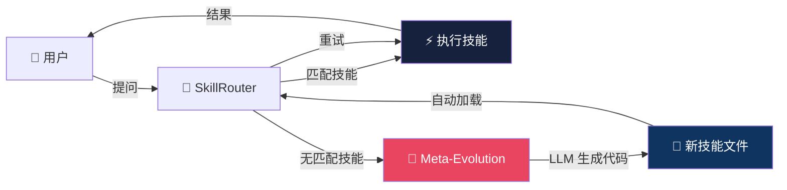
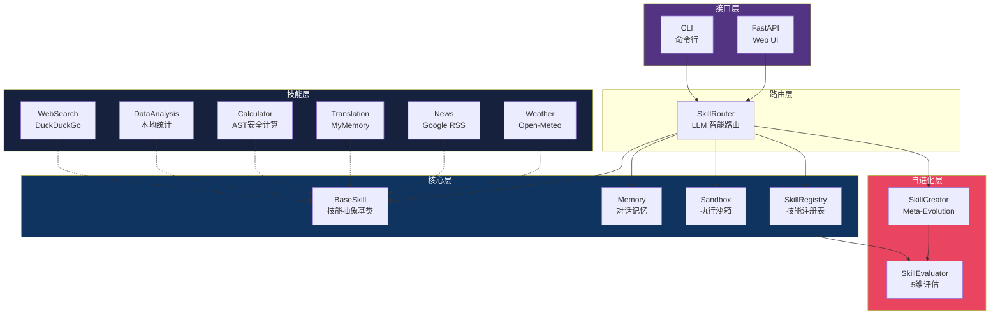
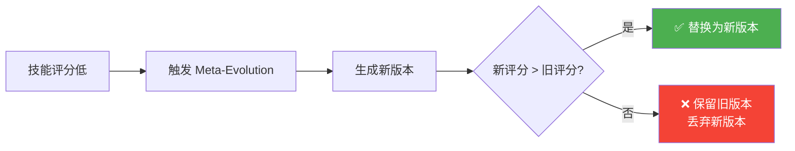
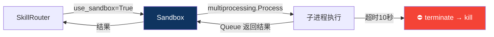

<div align="center">

# 🧠 Synapse

**自进化 AI Agent 架构 — 当 Agent 遇到不会的事，它会自己写代码学会**

[](https://python.org)
[](LICENSE)
[](https://openai.com)

[English](#english) · [快速开始](#快速开始) · [架构](#架构) · [技能列表](#技能列表) · [Web UI](#web-ui) · [设计哲学](#设计哲学)

</div>

---

> *"如果 Agent 遇到一个它不会的任务，它不应该说'我做不到'——它应该说'等我一下，我去学一下'。"*

Synapse 是一个**自进化（Meta-Evolution）AI Agent 框架**。当用户请求超出当前技能范围时，Synapse 会调用 LLM 自动生成新的 Python 技能文件，加载后立即执行——**Agent 在运行时自己教自己新能力**。

## 核心循环



## 为什么做这个

现有的 Agent 框架（AutoGPT、LangChain Agents 等）都是**静态技能集**——开发者预定义了哪些工具，Agent 就只能用哪些工具。如果用户想要一个不存在的功能，Agent 只能说"我做不到"。

Synapse 的核心理念是：**Agent 应该和生物神经系统一样，能够根据刺激生长新的突触连接（Synapse）。**

| 传统 Agent | Synapse |
|-----------|---------|
| 预定义技能集，用不了就报错 | 运行时自动生成新技能 |
| 开发者手动添加工具 | LLM 自动编写工具代码 |
| 技能坏了只能等更新 | 棘轮机制自动修复低质量技能 |
| 无对话记忆 | 内置 session 记忆系统 |
| 技能直接在主进程执行 | 进程级沙箱隔离 |

## 架构



## 技能列表

所有技能**开箱即用**，无需额外 API Key（除 OpenAI 外）：

| 技能 | 说明 | 依赖 | 需要 Key? |
|------|------|------|----------|
| 🔍 **WebSearch** | DuckDuckGo 互联网搜索 | `duckduckgo-search` | ❌ |
| 📊 **DataAnalysis** | 描述性统计分析（均值/中位数/标准差） | `statistics`（标准库） | ❌ |
| 🧮 **Calculator** | 安全数学表达式计算（AST 白名单） | `ast`（标准库） | ❌ |
| 🌐 **Translation** | 文本翻译 | MyMemory API | ❌ |
| 📰 **News** | 新闻查询 | Google News RSS | ❌ |
| 🌤️ **Weather** | 天气查询 | Open-Meteo API | ❌ |
| 🧬 **Auto-Generated** | 由 Meta-Evolution 自动生成的技能 | 视情况而定 | 视情况而定 |

## 自进化机制

借鉴 [darwin-skill](https://github.com/alchaincyf/darwin-skill) 的评估体系和微软 [SkillLens](https://arxiv.org/abs/2605.23899) 论文的实证 rubric 设计：

### 5 维度技能健康度评估（满分 100）

| 维度 | 权重 | 说明 |
|------|------|------|
| **结构质量** | 20 | 是否有完整的 name/description/args/response |
| **执行成功率** | 30 | success_count / total_count |
| **错误处理** | 20 | 是否有 error 字段和 fallback |
| **具体性** | 15 | description 是否包含触发词 |
| **反模式检测** | 15 | 是否包含危险操作黑名单 |

### 棘轮机制（Ratchet）



分数只升不降。每一轮要么改进技能，要么干净地丢弃。不会随时间积累局部退化。

## 安全机制

### 进程级沙箱

Meta-Evolution 生成的代码在独立子进程中执行：



- ✅ 技能异常不影响主进程（`multiprocessing.Process` 隔离）
- ✅ 10 秒超时自动终止；若 `terminate()` 1 秒后仍存活，升级为 `kill()` (SIGKILL) 防僵尸进程
- ✅ `Sandbox.execute_async` 通过 `run_in_executor` 在后台线程执行，不阻塞 FastAPI 事件循环
- ✅ 显式关闭 `Queue` 防 fd 泄漏
- ✅ `use_sandbox` 开关可关闭（开发调试用）

### 文件名安全

LLM 生成的文件名经过严格校验：
- `os.path.basename()` 提取纯文件名
- 拒绝包含 `/` 或 `\\` 的路径
- 保留连字符 `-`（如 `crypto-price-skill.py`）

## 对话记忆

支持多轮对话上下文，Agent 能记住之前聊过什么：

```
用户: 北京天气怎么样？
Agent: 北京目前晴朗，气温 28°C。

用户: 那上海呢？
Agent: 上海目前多云，气温 25°C。  ← Agent 理解"那上海呢"是指天气
```

- 按 `session_id` 隔离不同会话
- 限制最近 10 轮历史，防止上下文溢出
- JSON 文件持久化，重启不丢失

## Web UI

```bash
uvicorn web.app:app --reload
```

打开 `http://localhost:8000` 即可使用暗色主题聊天界面。

## 快速开始

### 1. 安装依赖

```bash
pip install -r requirements.txt
```

### 2. 配置环境变量

```bash
cp .env.example .env
# 编辑 .env，填入你的 OPENAI_API_KEY
```

### 3. 启动 CLI

```bash
python cli.py
```

### 4. 或启动 Web UI

```bash
uvicorn web.app:app --reload
```

### 5. 试试这些

```
> 北京天气怎么样？
> 帮我搜索 Python asyncio 最佳实践
> 分析这组数据: 23, 45, 12, 67, 34, 89, 56
> 计算 (2 + 3) * 4 ** 2
> 把 "Hello World" 翻译成中文
> 最新科技新闻
> 帮我查一下苹果公司的股价    ← 触发 Meta-Evolution，自动生成股票技能！
```

## 如何写一个新技能

1. 在 `skills/` 目录创建 Python 文件
2. 继承 `BaseSkill`，实现 4 个属性 + 1 个方法
3. 保存后自动发现，无需手动注册

```python
from pydantic import BaseModel, Field
from typing import Type, Optional
from core.base import BaseSkill

class MyArgs(BaseModel):
    query: str = Field(..., description="搜索关键词")

class MyResponse(BaseModel):
    result: str
    error: Optional[str] = None

class MySkill(BaseSkill):
    @property
    def name(self) -> str:
        return "my_skill"

    @property
    def description(self) -> str:
        return "做什么事。触发词：xxx, yyy, zzz"

    @property
    def expected_args(self) -> Type[BaseModel]:
        return MyArgs

    @property
    def expected_response_type(self) -> Type[BaseModel]:
        return MyResponse

    async def execute(self, **kwargs) -> MyResponse:
        args = self.validate_args(**kwargs)
        try:
            return MyResponse(result="...")
        except Exception as e:
            return MyResponse(result="", error=str(e))
```

## 项目结构

```
Synapse/
├── core/                    # 核心层
│   ├── base.py              # BaseSkill 抽象基类
│   ├── memory.py            # 对话记忆（session 管理 + JSON 持久化）
│   ├── sandbox.py           # 进程级沙箱隔离
│   └── skill_registry.py    # 技能注册表（执行统计 + 健康度）
├── router/
│   └── router.py            # LLM 智能路由 + 记忆注入 + 沙箱执行
├── meta/                    # 自进化层
│   ├── skill_creator.py     # Meta-Evolution（LLM 自动生成技能）
│   └── skill_evaluator.py   # 5 维度技能评估 + 棘轮机制
├── skills/                  # 技能库（自动发现）
│   ├── web_search_skill.py  # 🔍 DuckDuckGo 搜索
│   ├── data_analysis_skill.py # 📊 本地统计分析
│   ├── calculator_skill.py  # 🧮 安全数学计算
│   ├── translation_skill.py # 🌐 文本翻译
│   ├── news_skill.py        # 📰 新闻查询
│   └── weather_skill.py     # 🌤️ 天气查询
├── web/                     # Web UI
│   ├── app.py               # FastAPI 后端
│   └── static/              # 前端（暗色主题聊天界面）
├── cli.py                   # CLI 入口
├── tests/                   # 测试
└── requirements.txt
```

## 设计哲学

### 五条核心原则

| # | 原则 | 说明 |
|---|------|------|
| 01 | **自动优于手动** | 技能自动发现、自动生成、自动评估、自动修复 |
| 02 | **棘轮不倒退** | 技能评分只升不降，新版本必须优于旧版本 |
| 03 | **隔离保安全** | LLM 生成的代码在沙箱中执行，异常不影响主进程 |
| 04 | **记忆即上下文** | Agent 记住对话历史，支持追问和上下文理解 |
| 05 | **零额外 Key** | 除 OpenAI 外，所有技能使用免费 API，无需额外 API Key |

### 与相关项目的对比

| 特性 | Synapse | AutoGPT | LangChain Agents | OpenManus |
|------|---------|---------|-----------------|-----------|
| 运行时技能生成 | ✅ Meta-Evolution | ❌ | ❌ | ❌ |
| 技能质量评估 | ✅ 5维评估 | ❌ | ❌ | ❌ |
| 棘轮机制 | ✅ | ❌ | ❌ | ❌ |
| 执行沙箱 | ✅ multiprocessing | ❌ | ❌ | ✅ Docker |
| 对话记忆 | ✅ 内置 | ✅ | ✅ | ✅ |
| 零额外 API Key | ✅ | ❌ | ❌ | ❌ |
| Web UI | ✅ 内置 | ❌ | ❌ | ✅ |

## 已知限制

诚实地列出当前的边界，方便使用者判断是否适合自己：

- **沙箱是进程级而非容器级**：`multiprocessing.Process` 隔离了 GIL 和崩溃传播，但**不是**安全边界。Meta-Evolution 生成的代码在加载前会经过顶层 AST 安全检查 + 反模式扫描（堵住 `os.system` / `eval` / `subprocess` 等顶层调用），但若你需要在多租户/不可信环境部署，请额外套上 Docker/gVisor 等容器隔离。OpenManus 的 Docker 沙箱在这个维度更严格。
- **依赖 OpenAI tool-calling**：技能路由通过 OpenAI Function Calling 决定，目前仅显式测试了 OpenAI API。接入 Anthropic / Gemini / Qwen 等兼容 OpenAI 协议的端点理论可行，但未做端到端验证。
- **记忆是单 session FIFO**：当前 `Memory` 是按 `session_id` 隔离的最近 N 轮上下文（默认 10 轮 = 20 条消息），**不做** 语义抽取或跨 session 个性化。若需要长期记忆/向量检索，可替换 `router.memory` 为 mem0 或 LangGraph checkpointer（见 `synapse-memory/spec.md` 的 Decision Log）。
- **Meta-Evolution 不是无中生有**：生成的技能质量受底层 LLM 能力影响。弱模型可能生成语法正确但语义错误的代码——这正是棘轮机制要兜底的场景，但兜底不等于万能。
- **新闻技能仅返回标题+链接**：Google News RSS 不提供正文摘要；如需正文，需自行抓取或升级到带 API key 的服务。
- **测试套件聚焦单元/集成**：当前 93 个测试覆盖核心组件与 Bug 修复回归，但**没有**端到端 LLM 真实调用的冒烟测试（避免 CI 烧 token）。生产部署前建议手动跑一次 `python cli.py` 验证真实链路。

## 致谢

- **[darwin-skill](https://github.com/alchaincyf/darwin-skill)** — 多维度评估体系和棘轮机制的设计灵感来源（借鉴概念，未使用代码）
- **[SkillLens](https://arxiv.org/abs/2605.23899)** (Microsoft Research, 2026) — 实证 rubric 设计；指出 25% 的 LLM 生成技能会产生 negative transfer，验证了我们做棘轮的必要性
- **[SkillOpt](https://arxiv.org/abs/2605.23904)** (Microsoft Research, 2026) — validation-gated edits 框架；其 "textual learning rate + held-out gate" 思路与我们的棘轮机制异曲同工
- **[SKILLAXE](https://arxiv.org/abs/2606.10546)** (Microsoft Research, 2026) — evaluation-guided self-refinement；4 维诊断(quality impact / trigger precision / instruction compliance / solution-path coverage)启发了我们的 dim4 具体性评估
- **[autoresearch](https://github.com/karpathy/autoresearch)** (Karpathy) — 自主实验循环的原始灵感

---

<div align="center">

**Synapse — 当 Agent 遇到不会的事，它自己写代码学会。**

**Author**: Wayhhow · **License**: MIT

</div>

---

<a id="english"></a>

## English

Synapse is a **self-evolving AI Agent framework**. When a user request falls outside the current skill set, Synapse invokes an LLM to automatically generate a new Python skill file, loads it, and executes it — **the Agent teaches itself new capabilities at runtime.**

### Quick Start

```bash
pip install -r requirements.txt
cp .env.example .env  # Add your OPENAI_API_KEY
python cli.py          # CLI mode
# OR
uvicorn web.app:app --reload  # Web UI mode
```

### Key Features

- 🧬 **Meta-Evolution** — Auto-generates new skills when existing ones can't handle a request
- 📊 **5-Dimension Skill Evaluation** — Structure, success rate, error handling, specificity, anti-patterns
- 🔒 **Sandbox Execution** — LLM-generated code runs in isolated subprocesses (terminate → SIGKILL escalation, async-safe via `run_in_executor`)
- 💬 **Conversation Memory** — Multi-turn context with session management (thread-safe `RLock` + atomic file writes)
- 🔍 **6 Built-in Skills** — Web Search, Data Analysis, Calculator, Translation, News, Weather
- 🌐 **Web UI** — Dark-themed chat interface via FastAPI
- 🔑 **Zero Extra API Keys** — All skills use free APIs (except OpenAI)

### Known Limitations

- Sandbox is process-level (not container-level) — add Docker/gVisor for untrusted multi-tenant use
- Routing depends on OpenAI tool-calling protocol; Anthropic/Gemini/Qwen compatibility unverified end-to-end
- Memory is single-session FIFO (no semantic extraction / cross-session personalization) — swap `router.memory` for mem0 if you need long-term memory
- Generated skill quality is bounded by the underlying LLM — the ratchet catches regressions but isn't omniscient
